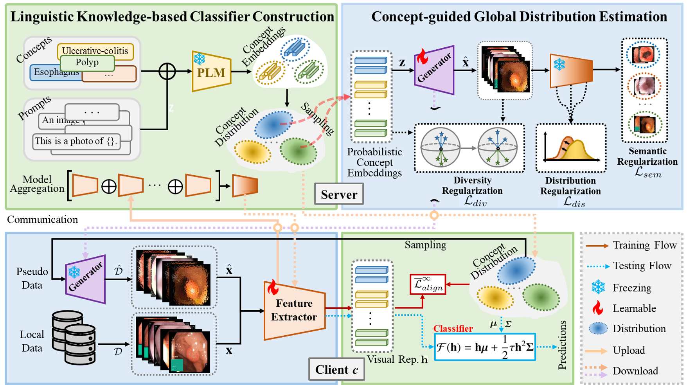

# FedBM
Code for our papers: 
- Stealing Knowledge from Pre-trained Language Models for Federated Classifier Debiasing, MICCAI 2024 (Early Accept) 
- FedBM: Stealing Knowledge from Pre-trained Language Models for Heterogeneous Federated Learning, MedIA 2025, under review

Federated learning (FL) has shown great potential in medical image computing since it provides a decentralized learning paradigm that allows multiple clients to train a model collaboratively without privacy leakage. However, current studies have shown that data heterogeneity incurs local learning bias in classifiers and feature extractors of client models during local training, leading to the performance degradation of a federation system. To address these issues, we propose a novel framework called Federated Bias eliMinating (FedBM) to get rid of local learning bias in heterogeneous federated learning (FL), which mainly consists of two modules, i.e., Linguistic Knowledge-based Classifier Construction (LKCC) and Concept-guided Global Distribution Estimation (CGDE). Specifically, LKCC exploits class concepts, prompts and pre-trained language models (PLMs) to obtain concept embeddings. These embeddings are used to estimate the latent concept distribution of each class in the linguistic space. Based on the theoretical derivation, we can rely on these distributions to pre-construct a high-quality classifier for clients to achieve classification optimization, which is frozen to avoid classifier bias during local training. CGDE samples probabilistic concept embeddings from the latent concept distributions to learn a conditional generator to capture the input space of the global model. Three regularization terms are introduced to improve the quality and utility of the generator. The generator is shared by all clients and produces pseudo data to calibrate updates of local feature extractors. Extensive comparison experiments and ablation studies on public datasets demonstrate the superior performance of FedBM over state-of-the-arts and confirm the effectiveness of each module, respectively.

<div align=center>

</div>

## Running
### Dependencies
```
pip install -r requirements.txt
```
### Scripts
- [x] download [Kvasir dataset](https://drive.google.com/file/d/1fzIIiZZYnpDtetjkdQOhSDTtjBkPbFCU/view?usp=sharing) and [OCT-8](https://drive.google.com/file/d/13Mm2TybL44jC2dMCh4flz0zXGE1VYGms/view?usp=sharing) datasets and put them into the dir './data/'.
- [x]  Train FedBM framework on OCT-8 dataset.
```
python main.py --exp_name='E1' \
--data_path='./data/Retinal_OCT-C8/' \
--node_num=12 \
--iid=0 \
--dirichlet_alpha=0.05 \
--local_model='ResNet18' \
--dataset='OCT' \
--T=200 \
--E=2 \
--select_ratio=0.5 \
--temperature=17.5 \
--method='FedBM' \
--batchsize=8 \
--lr=0.01 \
--num_classes=8 \
--g_iter=100 \
--lr_g=3e-4 \
--freq_g_driver=5 \
--synthesis_batch_size=64 \
--g_batchsize=16 \
--lambda_div=1 \
--lambda_dis=0.1 \
```
- [x] Train FedBM framework on Kvasir dataset.
```
python main.py --exp_name='E1' \
--data_path='./data/kvasir-dataset-v2-processed/' \
--node_num=10 \
--iid=0 \
--dirichlet_alpha=0.05 \
--local_model='ResNet18' \
--dataset='Kvasir' \
--T=200 \
--E=2 \
--select_ratio=0.5 \
--temperature=12.5 \
--method='FedBM' \
--batchsize=8 \
--lr=0.01 \
--num_classes=8 \
--g_iter=100 \
--lr_g=3e-4 \
--freq_g_driver=5 \
--synthesis_batch_size=64 \
--g_batchsize=32 \
--lambda_div=1 \
--lambda_dis=1 \
```

## Citation
If you find our work useful in your research or publication, please cite our work:
```
@inproceedings{2024Stealing,
  title={Stealing Knowledge from Pre-trained Language Models for Federated Classifier Debiasing},
  author={Zhu, Meilu and Yang, Qiushi and Gao, Zhifan and Liu, Jun and Yuan, Yixuan},
  booktitle={International Conference on Medical Image Computing and Computer-Assisted Intervention},
  year={2024}
}
```

## Contact

  Meilu Zhu (meiluzhu2-c@my.cityu.edu.hk)
